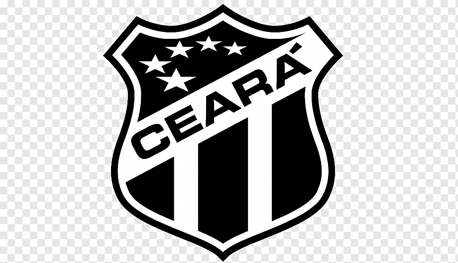

# MARKDOWN

Markdown é uma linguagem que usa simbolos fáceis para formatar textos.

# TÍTULOS:

Podemos adicionar títulos ao Markdown utilizando o simbolo #.
Sendo o (#) o maior título e (######) o menor título.

Exemplos:

# TÍTULO 1
## TÍTULO 2
### TÍTULO 3
#### TÍTULO 4
##### TÍTULO 5
###### TÍTULO 6

(atalho para replicar linha: shift + alt + seta)

# ÊNFASE NO TEXTO:

Negrito: Usamos **texto** para deixar um texto em negrito;  
Itálico: Usamos *texto* para deixar um texto em Itálico;  
Negrito e Itálico: Usamos ***texto*** para deixar um texto em Negrito e Itálico;  
Texto riscado: Usamos ~~texto~~ para deixar um texto em Texto riscado.

# LISTA NÃO ORDENADA:

- Matheus;
- Snadya;
- Thaís;
- Helberty;
    - Tomás;
    - Cássia.

# LISTA ORDENADA:

1. Criar conta no GitHub;
2. Instalar o VS Code na minha máquina;
3. Assistir as aulas do Academy.

# LINKS: 

[Clique aqui para saber mais](https://www.markdownguide.org/)

# IMAGEM:

# TABELAS:

| Nome:    | Curso:      | Cidade:           |
|----------|-------------|-------------------|
| Gabriel  | Full Stack  | Capital do Ceará  |
| Maykon   | Full Stack  | Capital do Ceará  |
| Sid      | Full Stack  | Capital do Ceará  |